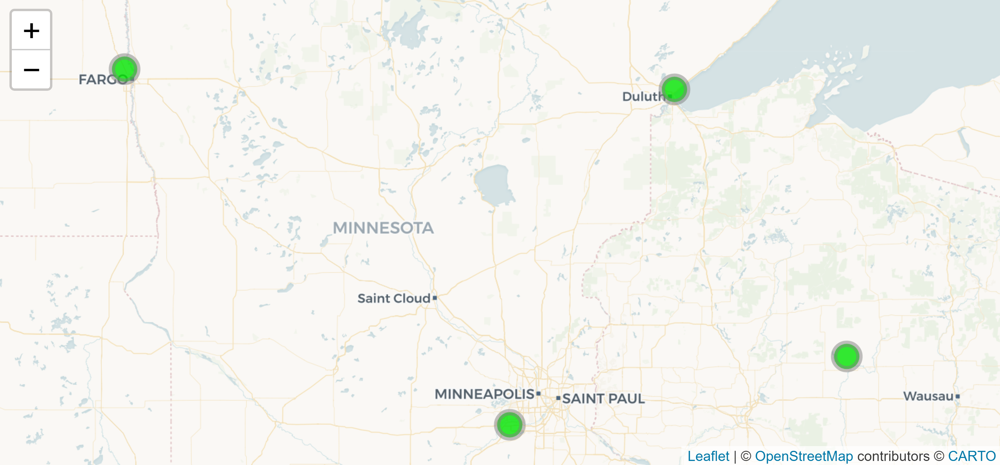

# basemap
:basecamp:🗺️ Add quick leaflet basemaps

## Install

To install `basemap` from Github:

``` r
# First install the 'remotes' package
library(remotes)

# Install the basemap package from GitHub
remotes::install_github("MPCA-data/basemap")
```

-----

## Use


### Load `leaflet` and `basemap`

``` r
library(leaflet)
library(basemap)
```

<br>

Now you can use `%>% add_basemaps()` in your leaflet pipeline.

## Light-themed basemap
``` r
leaflet(ozone_aqi) %>%
   addCircleMarkers(fillColor = ~aqi_color, 
                    color     = 'gray',
                    fillOpacity = 0.8) %>% 
   add_basemap()
```



<br>

## Dark-themed basemap
``` r
leaflet(ozone_aqi) %>%
   addCircleMarkers(fillColor = ~aqi_color, 
                    color     = 'gray',
                    fillOpacity = 0.8) %>%   
   add_basemap(dark = TRUE)
```


<br>

## Add multiple basemaps with layer controls
``` r
leaflet(ozone_aqi) %>%
   addCircleMarkers(fillColor = ~aqi_color, 
                    color     = 'gray',
                    fillOpacity = 0.8) %>%
   add_basemap(layers = TRUE)
```


<br>
